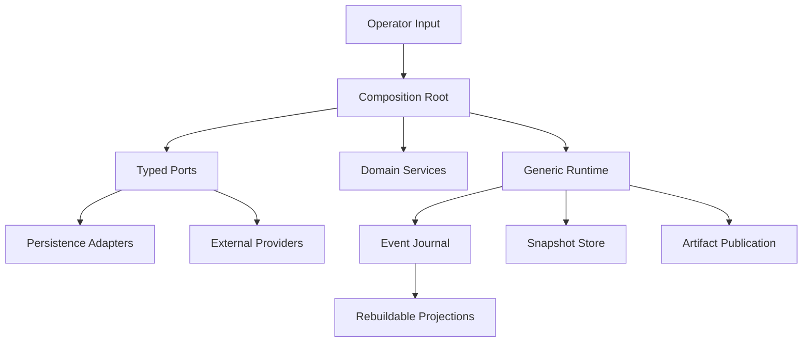

# 解耦、持久化与系统化深度审计

日期：2026-08-25
范围：当前 working tree 的 `research_platform`、`projects/sem_paper`、`scripts` 与既有架构报告。
本轮结论：只审计与建立目标，不在本报告对应轮次扩大代码改动。

## 一、完整改造目标

### 目标 A：单体解耦

任何核心模块最多承担一种主职责：领域规则、运行时编排、端口契约、持久化、外部适配、观测或 CLI。一个模块可以组合多个端口，但不能同时拥有多个权威状态源。

判定为完成的条件：

- 领域层不直接依赖 `Path`、JSON 文件、进程、网络或具体 SDK；
- runtime 只协调生命周期与状态迁移，不负责文件格式与发布策略；
- provider 只实现外部系统端口，不反向决定实验/业务政策；
- composition root 是唯一组装点，调用层只消费接口；
- 拆分后不存在第二套平行 runtime abstraction；
- 每个拆分出的 port 都有明确 owner、identity、错误语义和生命周期。

### 目标 B：持久化边界

持久化必须是显式能力，而不是散落的 `Path`/`json.dumps` 副作用。每一种 durable object 都要定义：schema、identity、revision、写入原子性、并发策略、恢复策略、损坏策略、保留策略和 provenance。

目标持久化对象分为六类：

| 类别 | 权威内容 | 必须支持 |
|---|---|---|
| Session state | 当前方法/证据/lineage 状态 | snapshot、CAS、恢复、schema migration |
| Event / mutation journal | 不可变变更事实 | append、顺序、幂等、重放 |
| Checkpoint | 世界与客户端状态 | capture、restore、identity 校验 |
| Run artifact | 实验输入、输出、日志、统计 | manifest、digest、引用、保留 |
| Qualification / live evidence | 部署与真实运行资格证据 | immutable binding、过期/漂移拒绝 |
| Projection / index | 可重建查询视图 | source cursor、重建、漂移检测 |

### 目标 C：系统化接口化

同类问题只能有一套抽象：provider identity、fixed/control 判定、artifact publication、durable store、checkpoint、diagnostics、error classification、composition binding 都必须集中到稳定的 typed contract。

接口不能只是把原有函数改名为 `Port`；必须能够替换实现、测试隔离、表达失败和恢复，并能从对象图中追溯其唯一 authority。

### 目标 D：可恢复与可验证

任何中断点都要回答：最后一个已确认事实是什么、哪些操作可能已执行、如何安全重试、如何判断数据是否属于同一 run/session/generation。恢复不可依赖“猜测最后状态”。

### 目标 E：科学与平台边界

平台只提供通用实验、运行、记录和恢复能力；SEM 只提供方法与实验组合。不能把 scientific metric、provider policy、Minecraft 生命周期重新塞回通用 runtime。

## 二、当前架构基线

已确认的正向基础：

- 单一拓扑声明 authority；
- generic experiment runtime 与 typed run spec 已接入；
- Minecraft provider、checkpoint coordinator、resume operation 已在环境组合层绑定；
- 当前架构基线为 `cycles=0`，无已知 import/layer/source-authority violation；
- SEM session state 已有 WAL、备份、CAS、checksum 与恢复逻辑；
- 已新增 domain-neutral durable object identity、store、factory、write receipt 契约；
- SEM snapshot store 已基于统一 durable store contract，并可由
  `DurableSEMSessionStateFactory` 注入替换后端。
- Minecraft session 的 diagnostics sink/failure buffering 已抽为
  `MinecraftSessionDiagnosticRecorder`，session 不再直接承载诊断副作用策略。
- Minecraft world-cut provider 的 manifest/branch metadata 发布已抽为
  `MinecraftWorldCutMetadataStorePort`，保留 `metadata_writer` 兼容适配器。
- Minecraft session checkpoint envelope 已通过
  `MinecraftSessionCheckpointPort` / `MinecraftCheckpointCoordinator` 注入，
  session 生命周期不再直接决定 checkpoint 编解码实现。
- Minecraft action identity、去重、verification ledger 和 checkpoint 快照已抽为
  `MinecraftActionLedger`，动作状态不再由 session 维护裸字典。

这些基础不能被后续拆分回滚或复制成第二套实现。

## 三、未充分解耦的单体与缺口

### P0：外部资格与真实运行证据仍未形成完整持久化闭环

`LIVE_EXECUTION_EVIDENCE` 仍是唯一公开架构阻塞项。当前 provider、qualification、T2B、live evidence 的文件读取与绑定分布在脚本和 provider 中，尚未形成一个统一的 immutable evidence binding port。风险是：代码、部署路由、运行资格和结果 artifact 可以分别有效，但没有同一个不可变 identity 将它们锁在一起。

### P1：Minecraft session runtime 仍是多职责单体

`research_platform/environment/minecraft/runtime/session.py` 同时处理：bridge 生命周期、观察投影、动作去重与 reconciliation、diagnostics、checkpoint capture/restore、错误分类和 close 语义。它已经有 `MinecraftBridgePort`、`MinecraftCheckpointPort`、`MinecraftDiagnosticsPort`，但 session 仍直接编排这些政策。

建议拆为：`SessionLifecycleCoordinator`、`ActionExecutionCoordinator`、`ObservationProjectionPort`、`SessionCheckpointPort`、`SessionDiagnosticRecorder`，由一个薄 session facade 组合。拆分优先保持现有 `EnvironmentSession` contract 不变。

### P1：Minecraft world-cut provider 把文件系统、复制策略、manifest、checkpoint 和安全策略混在一起

`research_platform/environment/minecraft/providers/world_cut.py` 同时负责路径越界防护、树扫描、digest、复制实现选择、metadata 写入、source cut、branch checkpoint 和恢复验证。复制策略与持久化格式变化会影响世界身份和恢复语义。

建议拆为：`WorldPathPolicy`、`WorldTreeManifest`、`WorldCopyPort`、`WorldCutStorePort`、`BranchCheckpointStorePort`、`WorldCutRecoveryPolicy`。manifest 与 copy 应先形成纯值对象，再由 provider 持久化。

### P1：SEM scientific metrics 同时拥有 schema、文件 store、finalizer、统计估计

`projects/sem_paper/composition/scientific_metrics.py` 同时承担辅助样本 schema 解码、目录存储、证据终结、输入校验、统计比较与 lifetime estimand。统计规则与文件格式的变动风险相互传递。

建议拆为：`AuxiliaryEvidenceCodec`、`AuxiliaryEvidenceStorePort`、`AuxiliaryEvidenceFinalizer`、`ScientificEstimandEngine`、`ScientificReportPublisher`。估计引擎只接收 typed observations/evidence，不接收路径。

### P1：qualification probe 是网络解析、缓存、候选筛选、安全校验和策略决策单体

`research_platform/model/qualification/providers/qualification_probe.py` 约 1561 行，包含 HTML/索引抓取、版本解析、metadata 读取、候选筛选、Python compatibility、artifact 选择和根级策略。网络 IO、缓存和 qualification policy 没有形成清晰端口边界。

建议拆为 `PackageIndexPort`、`MetadataSourcePort`、`ArtifactCandidateSelector`、`CompatibilityPolicy`、`QualificationDecisionEngine`；所有网络和缓存通过端口注入。

### P1：agent cognition loop 仍混合循环调度、checkpoint、诊断和动作执行

`research_platform/participant/agent/runtime/cognition_loop.py` 是 agent loop 的状态机、进度保存和诊断协调点。需要明确 loop state reducer 与 durable progress publisher 的边界，避免恢复逻辑直接依赖执行器局部变量。

### P2：Minecraft workload 与 non-Minecraft workload 存在平行适配逻辑

两个模块分别实现任务绑定、方法端点选择、失败策略、证据、完成判断和 bound execution。虽然已有通用 workload runtime，但项目层仍有重复的 provider identity 解析、role 判断、候选解析和 observation 转换。后续应提取共享的 `CompiledVariantBindingResolverPort` 与 `WorkloadEvidencePublicationPort`，而不是继续复制适配器。

### P2：evolution composition 仍包含策略、阶段 wiring、fail-closed fallback 与 claim readiness

`projects/sem_paper/composition/evolution.py` 约 24 KB，混合 proposal policy、evaluation/adoption/reconciliation 组装、禁用实现和 scientific readiness 检查。应把 stage contract、authority bundle、claim gate 和 concrete factory 分层，避免一个 factory 同时决定“如何演化”和“是否允许科学声明”。

### P2：入口脚本仍是持久化编排热点

`scripts/sem_paper_minecraft_application.py` 中大量 `Path`、artifact publication、checkpoint、qualification、resume、result 和 cleanup 写入。脚本应只做输入绑定与 root 调用；run artifact、resume index、qualification evidence 和 result publication 应由 typed application service 组合。

## 四、当前持久化系统的系统性缺口

1. 持久化端口命名和错误语义不统一：`Store`、`Repository`、`ArtifactStore`、`CheckpointStore`、`EvidenceStore` 各自表达不同生命周期，缺少统一的 durable contract vocabulary。
2. schema/version 校验分散在各模块，缺少统一 migration registry；升级多靠“拒绝旧 schema”，不能系统化迁移。
3. 事件日志、snapshot、artifact 和 projection 的 source-of-truth 关系没有统一声明，重建边界需要逐模块推断。
4. 多数 durable writer 有原子写入，但缺少统一的 idempotency key / operation identity contract。
5. 脚本层直接构造目录和文件名，导致存储布局成为调用方知识，后续更换对象存储或数据库成本高。
6. diagnostics、failure、cleanup_failure、result 的持久化通道分离，缺少统一 run/session correlation 与 publication status。
7. 一些 `Any`/`object`/宽泛 `Mapping` 仍出现在动作 payload、diagnostics 和 provider adapter 中；审计门禁未报弱 public contract，但领域内部仍有类型泄漏。

## 五、目标对象图

约束：Domain 不依赖 Persistence；Runtime 不直接依赖具体文件；Persistence 不决定领域政策；Projection 只能从声明的 source journal/repository 重建。

## 六、实施路线

### Phase 0：冻结契约与清单

生成模块职责表、端口表、authority 表、持久化对象表、schema 表和恢复矩阵；所有改动前后运行 architecture/public-contract/silent-failure/no-degradation gates。

### Phase 1：统一持久化基础契约

建立 durable identity、revision、CAS、idempotency、codec、migration、store factory、publication receipt 的最小接口；将现有 SEM session state、MC checkpoint、auxiliary evidence 接入，不改变业务语义。

### Phase 2：拆分高风险运行单体

顺序：`session.py` → `world_cut.py` → `minecraft_workload.py` / `non_minecraft_workload.py` → `scientific_metrics.py`。每一步保留 facade，先迁移内部 owner，再删除旧私有路径。

### Phase 3：拆分 qualification 与 evolution composition

隔离网络/缓存/筛选/决策；隔离 proposal policy、authority bundle、claim gate 和具体 factory。

### Phase 4：收缩脚本入口

脚本只负责 CLI/input binding；将 run artifact、resume、qualification、result、cleanup 发布统一收口到 application service。

### Phase 5：持久化一致性与恢复演练

覆盖中断写入、并发 CAS、重复提交、半写 WAL、主文件损坏、备份恢复、schema migration、跨版本拒绝和 projection rebuild。

### Phase 6：删除重复抽象与旧路径

只有在 caller、对象图、测试、恢复演练和审计门禁全部通过后，才删除旧 facade 内部实现与重复 port。

## 七、审计结论

当前不是“缺少接口”的问题，而是已经有若干接口，却仍有职责、持久化和权威策略穿透接口边界。下一阶段的核心不是继续增加类，而是把以下三条链闭合：

1. `Domain state → typed mutation → journal/snapshot → recovery`；
2. `External provider → identity/effect receipt → artifact/evidence publication`；
3. `Composition root → one authority bundle → runtime adapters → projections`。

在 `LIVE_EXECUTION_EVIDENCE` 关闭前，不得宣称真实科学结果；解耦与持久化改造必须继续保持这一 fail-closed 约束。
